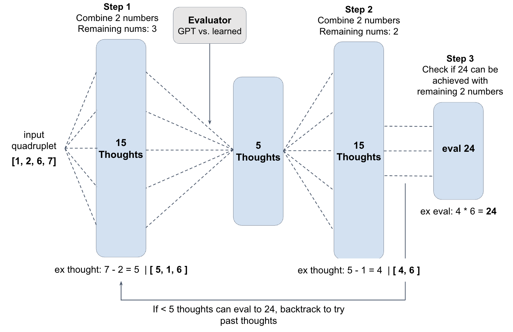
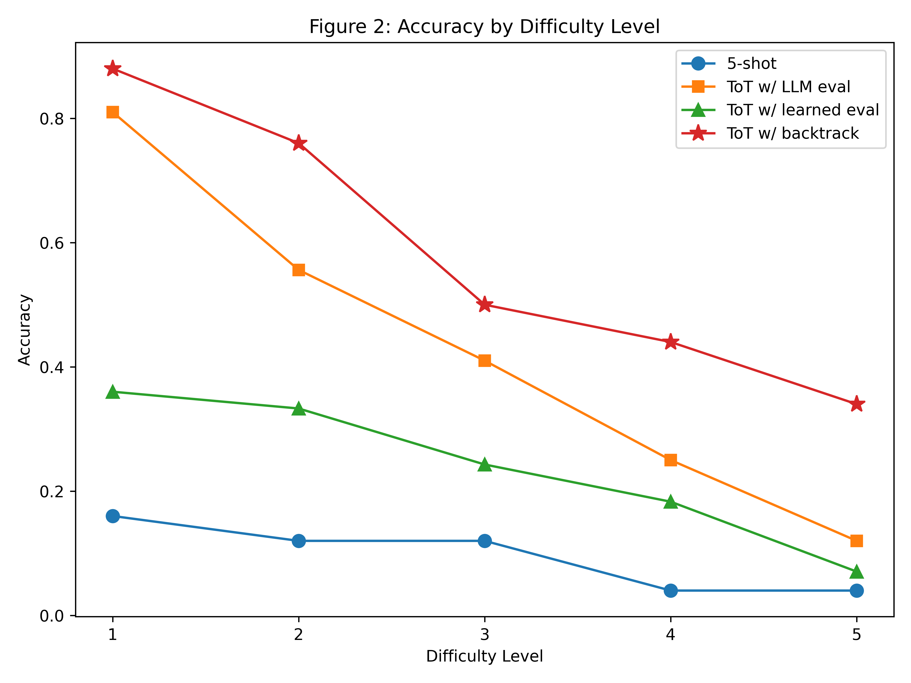
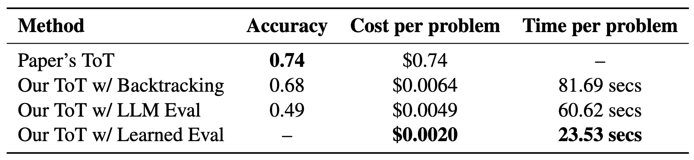

# Tree of Thoughts

## Introduction
LLMs struggle with structured, multi-step reasoning, limiting performance on complex problems that require planning or exploring multiple solution paths. To address this, we reproduce the Tree of Thoughts (ToT) [4] framework introduced by Yao et al. in 2023, which enhances the Chain of Thought (CoT) [3] approach by enabling language models to generate and explore diverse intermediate “thoughts” through a structured branching process, improving problem solving.

## Chosen Result
We reproduce the results from Section 4.1 of Yao et al’s 2023 paper, which demonstrates the improved performance of ToT on the Game of 24; a game that involves combining four numbers with basic arithmetic operations to create 24, a task that requires strategic planning and logical reasoning. The key result we aim to replicate is paper's ToT accuracy of 74% with b=5 where b is the maximum breadth of the tree at any given level.

## GitHub Contents
Our code is in the code folder, the data we used is in the data folder, our results are in the results folder...

## Re-implementation Details
- describe your approach to re-implementation or experimentation; include key details abt models, datasets, tools, and evaluation metrics, mention any challenges or modifications made to the original approach

## Reproduction Steps
Create a .env file and add your api key in the format OPENAI_API_KEY="YOUR_API_KEY_HERE". Then, you can choose to run ...

## Results/Insights
All of our ToT models outperform 5-shot GPT at every difficulty level as shown in Fig. 3. Backtracking yields accuracy comparable to the original paper where LLM evaluator > Learned evaluator > 5-shot. ToT with the LLM evaluator model is also 150x cheaper than the original paper.

## Conclusion
Our reproduction confirmed that ToT outperforms traditional LLMs on structured reasoning tasks like G24. The
systematic exploration of reasoning paths and backtracking are key to performance gains for G24, and more
broadly, complex reasoning tasks.

## References
[1] Diederik P. Kingma and Jimmy Ba. Adam: A method for stochastic optimization, 2017.

[2] OpenAI. Openai api. https://platform.openai.com, 2024. Computer software.

[3] Jason Wei, Xuezhi Wang, Dale Schuurmans, Maarten Bosma, Brian Ichter, Fei Xia, Ed Chi, Quoc Le, and
Denny Zhou. Chain-of-thought prompting elicits reasoning in large language models, 2023.

[4] Shunyu Yao, Dian Yu, Jeffrey Zhao, Izhak Shafran, Thomas L. Griffiths, Yuan Cao, and Karthik
Narasimhan. Tree of thoughts: Deliberate problem solving with large language models. 2023.

## Acknowledgements
This was the final project for Cornell University's CS 4/5782 Introduction to Deep Learning.
