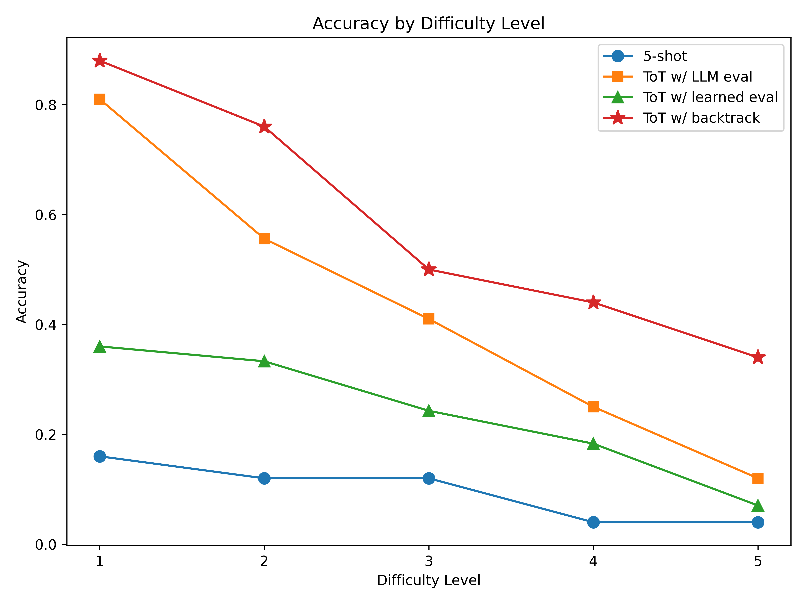

# Tree of Thoughts

## Introduction

This repository reproduces the Tree of Thoughts (ToT) [3] framework from Yao et al. (2023), which improves large language models’ (LLMs) performance on complex reasoning tasks through exploration of intermediate “thoughts” in a structured branching process.

## Chosen Result

We reproduce the key result from Section 4.1 of Yao et al. (2023) [3], which demonstrates ToT's 74% accuracy on the Game of 24 as compared to 7.3% for few-shot prompting.

## GitHub Contents

This GitHub repository includes the data, results, poster, and report as well as all code necessary to reproduce them.

| Directory Name | Description |
|-----------|-------------|
| Code      | Main implementation files. `/archive` contains unused code from the replication process |
| Data      | Generated input data for Game of 24 and pretrained weights used in the reinforcement learning model |
| Poster    | Presentation poster |
| Report    | Two-page final report |
| Results   | Graphs and tables showing experiment outcomes|

## Re-implementation Details

We created a **dataset** of 1,362 solvable Game of 24 problems using `code/create_dataset_go24.py` and evaluated our four models: 5-shot baseline, ToT with learned evaluator, ToT with LLM evaluator, and ToT with LLM evaluator + backtracking.

Due to API, cost, and time constraints, we modified the original paper by using **GPT-4o-mini** via OpenAI API [1] instead of GPT-4 (2023), experimented with a **learned value function**, replaced the full BFS tree exploration with a more efficient **backtracking mechanism**, and substituted evaluation at the end with **direct operations**.

## Reproduction Steps

1. Add your OpenAI API key to a `.env` file as `OPENAI_API_KEY="YOUR_API_KEY_HERE"`.
2. Run any of the following scripts in `code/` to see the performance of the models on a batch of 10 problems:
   - **LLM evaluator:** `/code/run_not_iid_tot_go24.py`
   - **LLM evaluator + backtracking:** `/code/run_backtracking_tot_go24.py`
   - **Learned evaluator:** `/code/run_value_net_tot_go24.py`
   - **5-shot baseline:** `/code/run_zeroshot_go24.py`
3. Optionally adjust problem difficulty in each script.

## Results/Insights

All of our ToT models outperform the baseline 5-shot GPT across all difficulty levels, as shown in the figure below. Incorporating backtracking achieves accuracy comparable to the original paper, following the performance hierarchy: LLM evaluator > Learned evaluator > 5-shot.

 Notably, our ToT model with the LLM evaluator is also approximately 150 times more cost-efficient than the original implementation.
 

## Conclusion

Our reproduction confirmed that ToT outperforms traditional LLMs on structured reasoning tasks like G24. The
systematic exploration of reasoning paths and backtracking are key to performance gains for G24, and more
broadly, complex reasoning tasks.

## References

[1] OpenAI. Openai api. https://platform.openai.com, 2024. Computer software.

[2] Jason Wei, Xuezhi Wang, Dale Schuurmans, Maarten Bosma, Brian Ichter, Fei Xia, Ed Chi, Quoc Le, and
Denny Zhou. Chain-of-thought prompting elicits reasoning in large language models, 2023.

[3] Shunyu Yao, Dian Yu, Jeffrey Zhao, Izhak Shafran, Thomas L. Griffiths, Yuan Cao, and Karthik
Narasimhan. Tree of thoughts: Deliberate problem solving with large language models. 2023.

## Acknowledgements

This was the final project for Cornell University's CS 4/5782 Introduction to Deep Learning.
